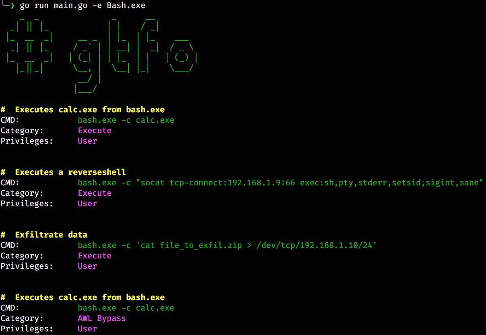

[](https://www.gnu.org/licenses/gpl-3.0)


<h1 align="center">
  <br>
  <a href="https://github.com/mzfr/go-gtfo"></a>
  <br>
</h1>

Reimplementation of my tool [gtfo](https://github.com/mzfr/gtfo) in Go.

I'm mostly doing this as a means of learning Go as it seemed like a nice first project to start with. Also, it's much easier to make binaries from Go scripts.


## Gallery

* `gtfo -b nmap`


* `gtfo -e At.exe`


* `gtfo -e Bash.exe`



* `gtfo -b randomnamehere`


## Usage


```
Search gtfobin and lolbas from terminal

Options:
  -b, --bin <binary>       Search Linux binaries on gtfobins
  -e, --exe <EXE>          Search Windows exe on gtfobins
```

## Installation

You can download the pre-compiled binary from [here](https://github.com/mzfr/go-gtfo/releases)

If you want to make changes to the code and then compile the binary you can clone this repo and then run:

```
go build
```

Also, you can run the following command to install it directly:

```
go get github.com/mzfr/go-gtfo
```

If you want to run this locally then do the following:

1) Clone this repo: `git clone https://github.com/mzfr/go-gtfo`
2) run: `go run main.go -b <binary_name>`

__Note__: Make sure you have go installed.

## Support

If you'd like you can buy me some coffee:

<a href="https://www.buymeacoffee.com/mzfr" target="_blank"></a>
